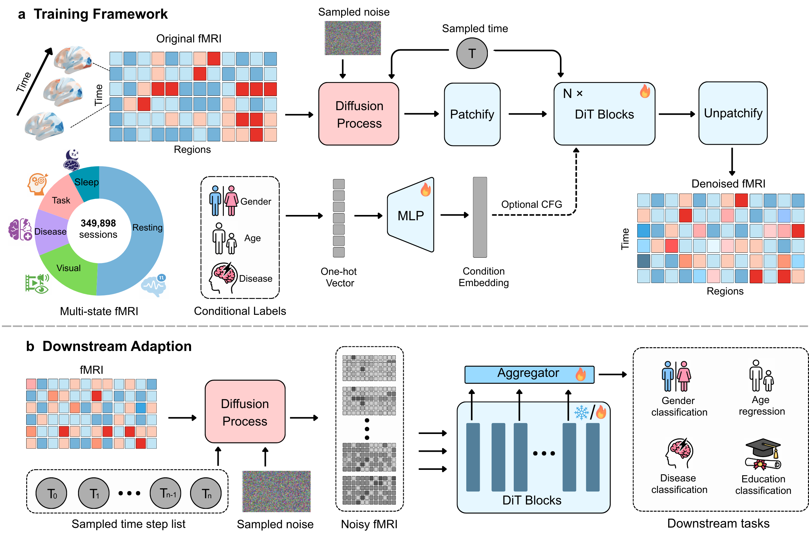

# BrainDIT

Brain-DiT is a universal multi-state foundation model pretrained on 349,898 fMRI sessions from 24 datasets, encompassing resting, task, naturalistic, disease, and sleep states. Unlike prior fMRI foundation models that focus on masked input reconstruction or latent space alignment, _Brain-DiT_ models the generative distribution of region-of-interest (ROI) time series using a metadata-conditioned Diffusion Transformer (DiT), enabling universal representations that transfer across states and populations.

## Repository Structure

- `core/data`: data I/O and preprocessing utilities (CSV parsing, dataset loading, and helper functions)
- `train`: Diffusion pretraining
- `downstream`: Downstream adaptation and embedding extraction
- `configs`: example configuration files for training and inference
- `scripts`: runnable shell scripts for training, inference, and demos
  This repository includes only the modules required for pretraining and downstream adaptation.

## Data Splits (`splits/`)

Subject-level train/val/test splits are provided under `splits/` for all datasets used in this project.

- Format: each `train.csv`, `val.csv`, and `test.csv` contains only subject IDs, one per line, with no extra columns.
- Audit: each dataset folder includes `audit.json` with split counts and processing notes.
- Global summary: `splits/audit_summary.json` aggregates split statistics across datasets.

Example layout:

```text
splits/
  ABIDE/
    train.csv
    val.csv
    test.csv
    audit.json
```

## Benchmark Logs (`logs/`)

`logs/` stores benchmark outputs used for result tracking and plotting (e.g., linear probe/fine-tune experiments).

Example layout:

```text
logs/
  lp/
    NKI_AGE/
      BrainDIT/
      brainmass/
      brainjepa/
```

## Framework



## Dataset Summary

Summary of datasets used in this study.

| ID        | Dataset         | Train Participants | Total Participants | Total samples | State        |
| --------- | --------------- | -----------------: | -----------------: | ------------- | ------------ |
| 1         | HCP             |                707 |               1010 | 121222        | Resting      |
| 2         | CHCP            |                218 |                312 | 16950         | Resting      |
| 3         | ABCD            |               1680 |               2400 | 43186         | Resting      |
| 4         | PIPO1           |                 56 |                 80 | 2060          | Resting      |
| 5         | PIPO2           |                158 |                224 | 3360          | Resting      |
| 6         | ISYB            |                131 |                187 | 1870          | Resting      |
| 7         | NKI             |                502 |                717 | 12189         | Resting      |
| 8         | BHRC            |                325 |                465 | 2325          | Resting      |
| 9         | SALD            |                395 |                493 | 7886          | Resting      |
| 10        | SLIM            |                 91 |                130 | 1511          | Resting      |
| 11        | ABIDE           |                427 |                609 | 11671         | Disease      |
| 12        | ADHD            |                487 |                696 | 10365         | Disease      |
| 13        | ADNI            |                348 |                497 | 10701         | Disease      |
| 14        | PPMI            |                330 |                472 | 9480          | Disease      |
| 15        | HCP task        |                 83 |                118 | 9772          | Task         |
| 16        | CHCP task       |                165 |                223 | 18341         | Task         |
| 17        | task 103        |                  4 |                  6 | 2033          | Task         |
| 18        | Forest          |                 14 |                 20 | 1743          | Naturalistic |
| 19        | emo film        |                 20 |                 27 | 9885          | Naturalistic |
| 20        | NSD             |                  6 |                  8 | 30940         | Naturalistic |
| 21        | Things          |                  2 |                  3 | 5224          | Naturalistic |
| 22        | CineBrain       |                  3 |                  5 | 2887          | Naturalistic |
| 23        | HCP Movie       |                 82 |                118 | 9455          | Naturalistic |
| 24        | fMRI sleeping   |                 20 |                 29 | 4842          | Sleep        |
| **Total** | **24 datasets** |           **6254** |           **8849** | **349898**    | -            |

## Install

```bash
pip install -r requirements.txt
```

## Main training/inference entry

```bash
CONFIG_PATH=configs/stage1_raw.example.yaml bash scripts/train_stage1_raw.sh
MODE=general CONFIG_PATH=configs/stage3_raw_general.example.yaml bash scripts/run_stage3_raw.sh
```

Replace placeholder paths in example YAML before running.

## Minimal demos

### Demo A: toy training

```bash
PYTHON_BIN=/path/to/python \
bash scripts/demo_train_toy.sh
```

Output checkpoint:

- `outputs/demo_stage1_toy/checkpoints/best.pt`

### Demo B: pretrained checkpoint inference (embedding extraction)

```bash
PYTHON_BIN=/path/to/python \
bash scripts/demo_infer_pretrained.sh /path/to/checkpoints/best.pt
```

Or with env var:

```bash
CKPT_PATH=/path/to/checkpoints/best.pt bash scripts/demo_infer_pretrained.sh
```

Example checkpoint path patterns:

- `/path/to/Brain-DiT/checkpoints/best.pt`
- `/path/to/Brain-DiT_uncond/checkpoints/best.pt`
- `/path/to/Brain-DiT_424/checkpoints/best.pt`

Optional output tag:

```bash
CKPT_PATH=/path/to/best.pt CKPT_TAG=my_model bash scripts/demo_infer_pretrained.sh
```

Demo outputs:

- `outputs/demo_infer/<kind>/train_emb.npy`
- `outputs/demo_infer/<kind>/valid_emb.npy`
- `outputs/demo_infer/<kind>/test_emb.npy`
- `outputs/demo_infer/<kind>/meta.json`
