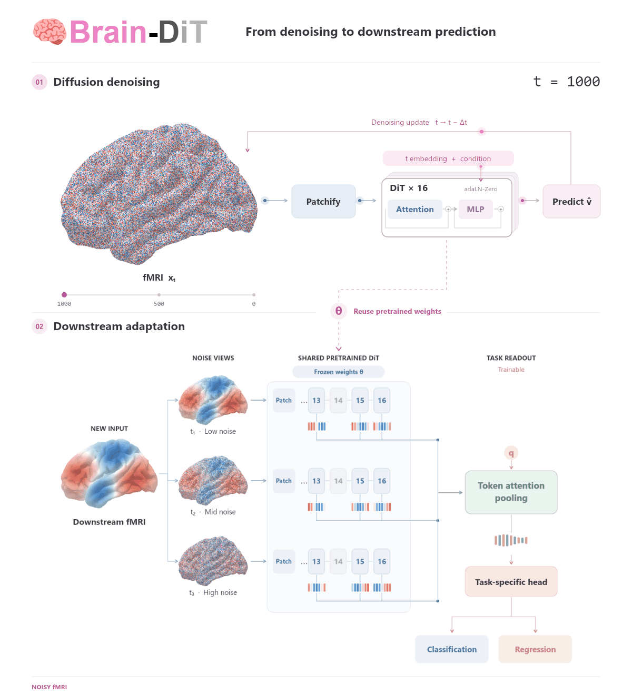
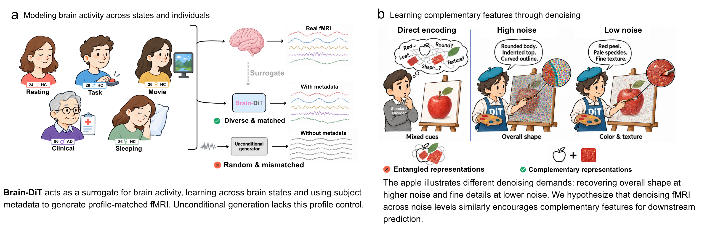
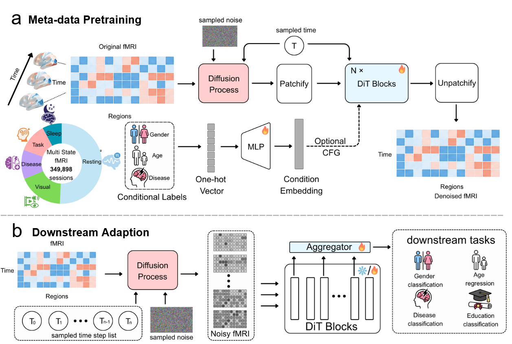
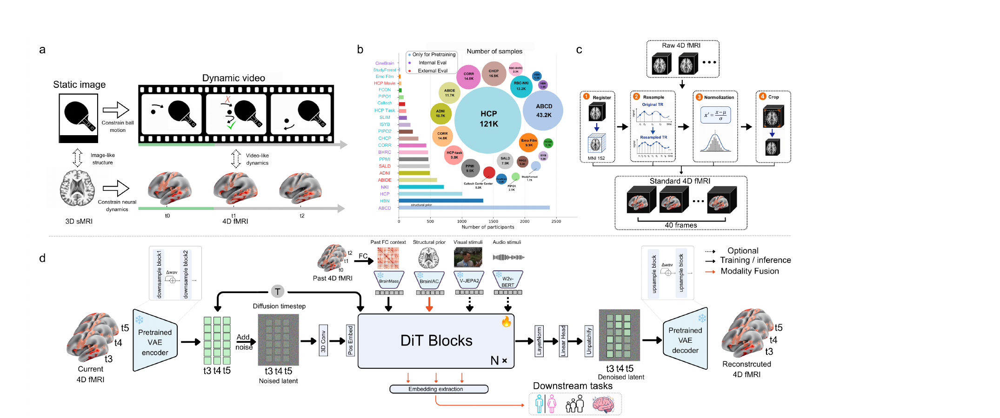

<p align="center">
  
</p>

<p align="center">
  <strong>🏆 MICCAI 2026 — Best Paper Award &amp; Young Scientist Award Shortlist</strong>
</p>

<p align="center">
  <a href="./figures/Brain-DiT-Poster.pdf"><strong>📄 Download the Brain-DiT Poster (PDF)</strong></a>
</p>

Brain-DiT is a universal multi-state foundation model. We curated 349,898 fMRI samples from 24 datasets spanning resting, task, naturalistic, disease, and sleep states. Brain-DiT was pretrained on 317,864 samples from 21 in-distribution (ID) datasets, while NKI, ADHD-200, and PPMI were strictly held out for out-of-distribution (OOD) evaluation. Unlike prior fMRI foundation models that focus on masked input reconstruction or latent space alignment, _Brain-DiT_ models the generative distribution of region-of-interest (ROI) time series using a metadata-conditioned Diffusion Transformer (DiT), enabling universal representations that transfer across states and populations.

## Overview

<p align="center">
  
</p>

## Motivation

<p align="center">
  
</p>

## Framework

<p align="center">
  
</p>

## [Follow-up Work](https://github.com/REDMAO4869/BrainWorld)

[**BrainWorld**](https://github.com/REDMAO4869/BrainWorld) ([paper](https://arxiv.org/abs/2606.17742)) is a follow-up work to Brain-DiT that extends generative modeling from ROI time series to whole-brain voxel-level 4D fMRI. BrainWorld encodes fMRI with a pretrained 4D VAE and uses a conditional DiT to model latent brain dynamics under past functional connectivity, structural MRI, and optional visual or audio conditions. Its intermediate DiT features can also be transferred to downstream tasks.

<p align="center">
  <a href="https://github.com/REDMAO4869/BrainWorld">
    
  </a>
  <br />
  <sub>Figure 2 from the BrainWorld paper: motivation, datasets, preprocessing, and model architecture.</sub>
</p>

## [Related Work](https://redmao4869.github.io/)

More related projects and publications are available on the [research homepage](https://redmao4869.github.io/).

## Pretrained Checkpoints

Pretrained model weights are available on Hugging Face:  
[BrainDiT/BrainDiT](https://huggingface.co/BrainDiT/BrainDiT/tree/main)

## Repository Structure

- `core/data`: data I/O and preprocessing utilities (CSV parsing, dataset loading, and helper functions)
- `train`: Diffusion pretraining
- `downstream`: Downstream adaptation and embedding extraction
- `configs`: example configuration files for training and inference
- `scripts`: runnable shell scripts for training, inference, and demos
  This repository includes only the modules required for pretraining and downstream adaptation.

## Data Splits (`splits/`)

Subject-level train/val/test splits are provided under `splits/` for all datasets used in this project.

- Format: each `train.csv`, `val.csv`, and `test.csv` contains only subject IDs, one per line, with no extra columns.
- Audit: each dataset folder includes `audit.json` with split counts and processing notes.
- Global summary: `splits/audit_summary.json` aggregates split statistics across datasets.

Example layout:

```text
splits/
  ABIDE/
    train.csv
    val.csv
    test.csv
    audit.json
```

## Dataset Summary

Summary of datasets used in this study.

| ID        | Dataset         | Train Participants | Total Participants | Total samples | State        | Pretraining Status |
| --------- | --------------- | -----------------: | -----------------: | ------------: | ------------ | ------------------ |
| 1         | HCP             |                707 |               1010 |        121222 | Resting      | ID                 |
| 2         | CHCP            |                218 |                312 |         16950 | Resting      | ID                 |
| 3         | ABCD            |               1680 |               2400 |         43186 | Resting      | ID                 |
| 4         | PIOP1           |                 56 |                 80 |          2060 | Resting      | ID                 |
| 5         | PIOP2           |                158 |                224 |          3360 | Resting      | ID                 |
| 6         | ISYB            |                131 |                187 |          1870 | Resting      | ID                 |
| 7         | NKI             |                502 |                717 |         12189 | Resting      | OOD                |
| 8         | BHRC            |                325 |                465 |          2325 | Resting      | ID                 |
| 9         | SALD            |                395 |                493 |          7886 | Resting      | ID                 |
| 10        | SLIM            |                 91 |                130 |          1511 | Resting      | ID                 |
| 11        | ABIDE           |                427 |                609 |         11671 | Disease      | ID                 |
| 12        | ADHD            |                487 |                696 |         10365 | Disease      | OOD                |
| 13        | ADNI            |                348 |                497 |         10701 | Disease      | ID                 |
| 14        | PPMI            |                330 |                472 |          9480 | Disease      | OOD                |
| 15        | HCP task        |                 83 |                118 |          9772 | Task         | ID                 |
| 16        | CHCP task       |                165 |                223 |         18341 | Task         | ID                 |
| 17        | task 103        |                  4 |                  6 |          2033 | Task         | ID                 |
| 18        | Forest          |                 14 |                 20 |          1743 | Naturalistic | ID                 |
| 19        | emo film        |                 20 |                 27 |          9885 | Naturalistic | ID                 |
| 20        | NSD             |                  6 |                  8 |         30940 | Naturalistic | ID                 |
| 21        | Things          |                  2 |                  3 |          5224 | Naturalistic | ID                 |
| 22        | CineBrain       |                  3 |                  5 |          2887 | Naturalistic | ID                 |
| 23        | HCP Movie       |                 82 |                118 |          9455 | Naturalistic | ID                 |
| 24        | fMRI sleeping   |                 20 |                 29 |          4842 | Sleep        | ID                 |
| **Total** | **24 datasets** |           **6254** |           **8849** |    **349898** | -            | **21 ID / 3 OOD**  |

`Train Participants` reports the subject-level training split distributed for each dataset. For the three OOD datasets, these splits are provided only for downstream evaluation and were not used during Brain-DiT pretraining.

## Install

```bash
pip install -r requirements.txt
```

## Main training/inference entry

```bash
CONFIG_PATH=configs/stage1_raw.example.yaml bash scripts/train_stage1_raw.sh
MODE=general CONFIG_PATH=configs/stage3_raw_general.example.yaml bash scripts/run_stage3_raw.sh
```

Replace placeholder paths in example YAML before running.

The Stage-1 example follows the paper's Schaefer-1000 setup. An AAL424 counterpart is provided at `configs/stage1_raw_aal424.example.yaml`.

## Minimal demos

### Demo A: toy training

```bash
PYTHON_BIN=/path/to/python \
bash scripts/demo_train_toy.sh
```

Output checkpoint:

- `outputs/demo_stage1_toy/checkpoints/best.pt`

### Demo B: pretrained checkpoint inference (embedding extraction)

```bash
PYTHON_BIN=/path/to/python \
bash scripts/demo_infer_pretrained.sh /path/to/checkpoints/best.pt
```

Or with env var:

```bash
CKPT_PATH=/path/to/checkpoints/best.pt bash scripts/demo_infer_pretrained.sh
```

Example checkpoint path patterns:

- `/path/to/Brain-DiT/checkpoints/best.pt`
- `/path/to/Brain-DiT_uncond/checkpoints/best.pt`
- `/path/to/Brain-DiT_424/checkpoints/best.pt`

Optional output tag:

```bash
CKPT_PATH=/path/to/best.pt CKPT_TAG=my_model bash scripts/demo_infer_pretrained.sh
```

Demo outputs:

- `outputs/demo_infer/<kind>/train_emb.npy`
- `outputs/demo_infer/<kind>/valid_emb.npy`
- `outputs/demo_infer/<kind>/test_emb.npy`
- `outputs/demo_infer/<kind>/meta.json`
